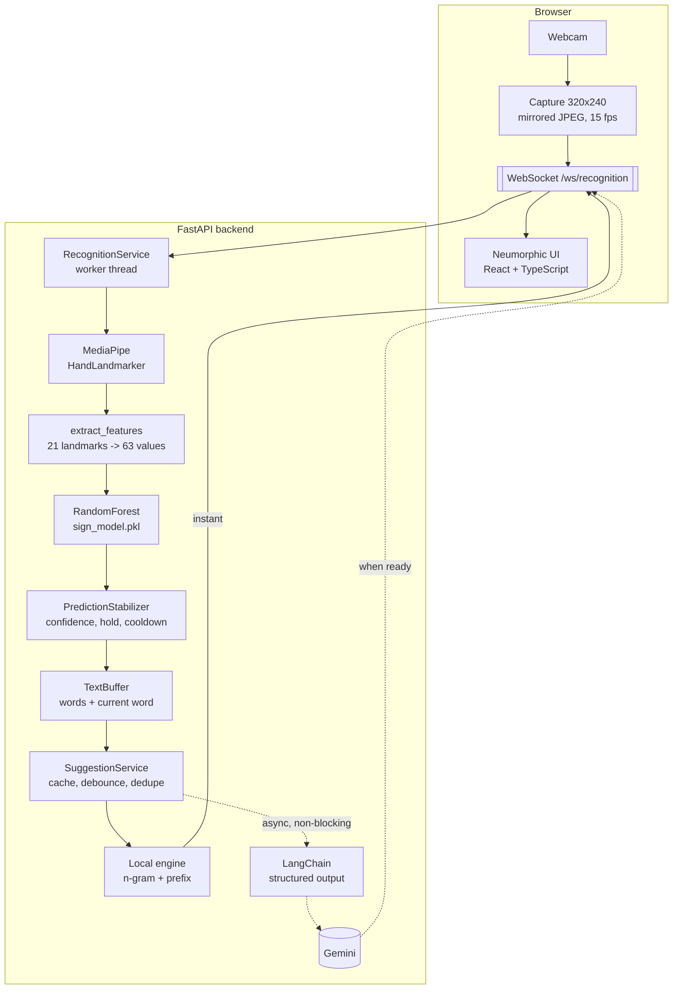

# HandSign Conversion

Real-time hand-sign communication, both directions.

**Sign → Text** — show fingerspelled letters to your camera and the app builds
words and sentences, with contextual word and sentence suggestions so you never
have to spell a whole thought.

**Text → Sign** — type English and see the matching hand signs, drawn from this
project's own recorded training data.

Built around an existing 26-letter classifier, which is preserved exactly: the
same `models/sign_model.pkl`, the same 63-feature extractor, the same
predictions — just called about **5× faster** and wrapped in an application.

---

## Contents

- [What it does](#what-it-does)
- [Architecture](#architecture)
- [Recognition pipeline](#recognition-pipeline)
- [How suggestions work](#how-suggestions-work)
- [Text → Sign](#text--sign)
- [Project structure](#project-structure)
- [Installation](#installation)
- [Running it](#running-it)
- [Configuration](#configuration)
- [API reference](#api-reference)
- [Tests](#tests)
- [Working with the ML model](#working-with-the-ml-model)
- [Troubleshooting](#troubleshooting)
- [Design decisions](#design-decisions)
- [Future improvements](#future-improvements)

---

## What it does

| | |
|---|---|
| **Letters** | A–Z fingerspelling, one hand, 26 classes |
| **Stabilisation** | Hold a sign to type it once — a two-second hold is one letter, not thirty |
| **Text** | Words, sentences, backspace, delete word, space, clear |
| **Suggestions** | Instant local predictions, upgraded by Gemini when it helps |
| **Reverse mode** | English text rendered as hand-sign illustrations |
| **Offline** | Everything except Gemini suggestions works with no network at all |

Recognition never depends on the language model. If Gemini is missing, slow or
broken, letters keep appearing and local suggestions keep working — the UI just
says so.

---

## Architecture



The dotted path is the important one: **nothing on the recognition path ever
waits for Gemini.** Local suggestions are pushed the moment a letter lands, and
a refined set arrives later as a second message — or never, harmlessly.

### Technology

| Layer | Choice | Why |
|---|---|---|
| Hand detection | MediaPipe Tasks `HandLandmarker` | Already used by the original project; ~10 ms/frame on CPU |
| Classifier | scikit-learn `RandomForestClassifier` (200 trees) | The existing trained model, unchanged |
| Backend | FastAPI + uvicorn | Async, native WebSocket, Pydantic validation |
| LLM orchestration | LangChain + `langchain-google-genai` | Prompt-as-data and validated structured output |
| Frontend | React 18 + TypeScript + Vite | No UI framework; hand-written CSS keeps the design honest |
| Theme | Dark by default, light available | One set of CSS custom properties, switched by `data-theme` on `<html>` |
| Transport | WebSocket | Frames and results are a continuous stream; polling would add latency for nothing |

---

## Recognition pipeline

```
Camera frame (browser)
  → mirror + downscale to 320×240 JPEG
  → WebSocket
  → MediaPipe: 21 hand landmarks          ~10 ms
  → extract_features: 63 normalized values  <1 ms
  → RandomForest: letter + confidence      ~6 ms
  → PredictionStabilizer: should this be typed?
  → TextBuffer: the sentence so far
  → back to the browser
```

### Feature extraction (unchanged)

`ml/features.py` is byte-for-byte the original. It is the contract the shipped
model was trained on, so it is pinned down by tests rather than improved:

1. subtract the wrist (landmark 0) from all 21 landmarks → position invariance;
2. divide by the wrist→middle-finger-MCP distance → scale invariance;
3. flatten to 63 floats.

### Stabilisation

A classifier that fires 15 times a second cannot type directly. `PredictionStabilizer`
applies four rules, all configurable in `.env`:

| Rule | Setting | Default | Effect |
|---|---|---|---|
| Confidence floor | `MIN_CONFIDENCE` | 0.80 | Unclear signs are shown but never typed |
| Hold to confirm | `STABLE_FRAMES` | 6 | ~0.4 s of agreement before a letter commits |
| Pose consumption | — | always | One hold types one letter; you must change pose to type again |
| Cooldown | `COMMIT_COOLDOWN_MS` | 700 ms | A wobbling hand cannot fire two letters at once |
| Duplicate gap | `DUPLICATE_SUPPRESSION_MS` | 1200 ms | Typing "LL" is possible but has to be deliberate |
| Release | `RELEASE_FRAMES` | 3 | One dropped frame does not reset your progress |

So `A A A A A A A A A` → **`A`**, and the UI tells you to change pose for the
next letter.

### Latency

Measured on this machine, single frame, CPU only:

| Stage | Time |
|---|---|
| JPEG decode | ~1 ms |
| MediaPipe detection | ~10 ms |
| Feature extraction | <0.1 ms |
| Classifier | ~6 ms |
| **Total** | **~17 ms** (≈ 58 fps of headroom at 15 fps capture) |

The classifier was **52 ms** before this project touched it. See
[Design decisions](#design-decisions).

---

## How suggestions work

Two engines, one interface.

**1. Local — always, instantly (<0.1 ms).** A frequency-ordered word list plus
bigram/trigram continuations mined from a corpus of everyday sentences, in
`backend/app/data/`. This is not a dictionary dump; it is context-aware:

```
HOW ARE      → YOU · THINGS · COMING
I WANT TO    → LEARN · GO · TALK · EAT
THANK + "Y"  → YOU · YEAR · YOUR
```

**2. Gemini — when it is worth it.** The local suggestions, the sentence so
far, the current word and the previous words are sent to Gemini through
LangChain, which returns a *validated Pydantic object*, not prose. The model is
told to behave like a keyboard: keep the prefix, prefer short common words,
rank by what this person plausibly means, and invent nothing.

Everything that keeps this fast and cheap lives in `SuggestionService`:

| Technique | What it prevents |
|---|---|
| Local-first push | The UI never waits for the network |
| Debounce (`SUGGESTION_DEBOUNCE_MS`) | Spelling `I·W·A·N·T` firing five requests instead of one |
| Cancellation | A stale answer arriving after you have typed on |
| TTL cache | Paying twice for the same sentence state |
| In-flight de-duplication | Two callers in the same state making two calls |
| Minimum-context gate | Calling the model for a single letter |
| Hard timeout | A slow model becoming a slow app |
| Output sanitising | A malformed response reaching the frontend |
| Local fallback | An outage removing suggestions entirely |

If Gemini returns a word that does not start with what you are spelling, it is
dropped. If it returns nothing usable, local results fill the gap, so you never
end up with *fewer* suggestions than before the call.

---

## Text → Sign

Type English, get hand signs.

The 26 illustrations in `frontend/public/signs/` are **generated from this
project's own dataset** by `ml/scripts/generate_sign_assets.py`: for each
letter it takes the per-coordinate median of all 500 recorded samples and draws
that hand as an SVG skeleton. That means the reference pictures are the signs
the classifier was actually trained on — not a generic alphabet chart that
might disagree with it — with no third-party image licensing involved.

Regenerate them any time:

```bash
python -m ml.scripts.generate_sign_assets
```

The letter → image mapping is served by `GET /api/signs` and consumed through
one frontend module (`src/lib/signAssets.ts`). No component contains an image
path, so replacing the artwork with photographs later is a change to the
generator and nothing else.

---

## Project structure

```
HandSign_Convertion/
├── ml/                          Pure ML layer — no web dependencies
│   ├── features.py              The 63-feature extractor (UNCHANGED)
│   ├── augmentation.py          Rotation/jitter for training data
│   ├── landmarks.py             Landmark type + hand topology
│   ├── detector.py              MediaPipe wrapper
│   ├── classifier.py            sign_model.pkl wrapper
│   ├── recognizer.py            frame → letter, the whole pipeline
│   ├── paths.py                 Filesystem locations
│   └── scripts/
│       ├── live_demo.py         OpenCV recognition check (no backend needed)
│       ├── collect_data.py      Record new training samples
│       ├── train_model.py       Retrain the classifier
│       ├── inspect_dataset.py   Dataset health report
│       └── generate_sign_assets.py
│
├── backend/app/
│   ├── main.py                  FastAPI app, model loaded once at startup
│   ├── core/                    Settings (.env), logging
│   ├── api/routes/              health, recognition, suggestions, session, signs
│   ├── schemas/                 Pydantic request/response models
│   ├── services/                stabilizer, text_buffer, session, suggestions,
│   │                            gemini, sign translation, recognition
│   ├── scripts/check_gemini.py  Diagnose the Gemini setup
│   └── data/                    words.txt, phrases.txt
│
├── frontend/
│   ├── src/
│   │   ├── views/               SignToTextView, TextToSignView
│   │   ├── components/          CameraStage, TextPanel, SuggestionPanel, SignTile
│   │   ├── lib/                 api, types, useCamera, useRecognitionSocket
│   │   └── styles/global.css    The design system
│   └── public/signs/            26 generated SVGs + manifest.json
│
├── dataset/                     A.csv … Z.csv — 13,714 labelled samples
├── models/
│   ├── sign_model.pkl           Original classifier (42 MB)
│   ├── sign_model_augmented.pkl Retrained with augmentation (39 MB)
│   └── hand_landmarker.task     MediaPipe model
├── archive/landmark-v1/         Frozen copy of the original model + dataset
├── tests/                       147 tests
├── run.py                       One entry point for every command
├── requirements.txt
├── .env.example
└── README.md
```

---

## Installation

### Requirements

- **Python 3.10–3.12.** MediaPipe has no wheels for 3.13+ yet; 3.12 is
  recommended.
- **Node.js 18+** for the frontend.

### Backend

```bash
git clone https://github.com/mahesan07/HandSign_Convertion.git
cd HandSign_Convertion

python -m venv .venv
.venv\Scripts\activate          # Windows
source .venv/bin/activate       # macOS / Linux

pip install -r requirements.txt
pip install -e .          # makes `ml` and `backend` importable from anywhere
```

Check the model loads and the dataset is intact:

```bash
python -m ml.scripts.inspect_dataset
```

### Frontend

```bash
cd frontend
npm install
```

### Gemini (optional)

```bash
cp .env.example .env
```

Put a key from [Google AI Studio](https://aistudio.google.com/app/apikey) in
`GEMINI_API_KEY` — **in `.env`, not `.env.example`.** Only `.env` is
git-ignored; `.env.example` is the committed template and must stay a
placeholder.

Then check it:

```bash
python -m backend.app.scripts.check_gemini
```

```
1. API key            found: AIzaSy... (39 chars)
2. Reaching the API   ok - 37 models available to this key
3. Configured model   gemini-flash-lite-latest — listed as available
4. A real request     "HOW ARE" + "YO"  [1947 ms]
                      words: ['YOU', 'YOUR']
Gemini is working.
```

Add `--list` to see every model your key can use. Skip all of this and the app
still works — local suggestions carry on and the UI says so.

The key never reaches the browser; the frontend only ever talks to your FastAPI
server.

---

## Running it

Two terminals, from anywhere in the project:

```bash
python run.py backend      # terminal 1 - the API on :8000
python run.py frontend     # terminal 2 - the web UI on :5173
```

Open **http://localhost:5173** and allow camera access.

> Use `localhost`, not `127.0.0.1` — Vite binds to localhost, and browsers only
> expose cameras on `localhost` or `https`.

`run.py` re-launches itself inside `.venv` if you started it with a different
Python, so you do not have to remember to activate anything. Everything else
has a subcommand too:

| Command | What it does |
|---|---|
| `python run.py doctor` | Check the install and report exactly what is missing |
| `python run.py demo` | Recognition in an OpenCV window — no browser, no backend |
| `python run.py check` | Verify the Gemini setup |
| `python run.py train` | Retrain the classifier |
| `python run.py collect K` | Record samples for one letter |
| `python run.py dataset` | Dataset health report |
| `python run.py signs` | Regenerate the sign illustrations |
| `python run.py test` | Run the test suite |

Run `python run.py` with no arguments for the full list.

### The long form

`run.py` is a convenience wrapper; the underlying commands work directly once
the venv is active and the project is installed (`pip install -e .`):

```bash
uvicorn backend.app.main:app --reload --port 8000
cd frontend && npm run dev
python -m ml.scripts.live_demo
```

### One-process deployment

```bash
cd frontend && npm run build && cd ..
uvicorn backend.app.main:app --port 8000
```

FastAPI then serves the built UI as well — the whole app is at
http://localhost:8000.

### Checking the ML on its own

```bash
python run.py demo
```

An OpenCV window with the raw pipeline: landmarks, letter, confidence, hold
progress, frame time. If a sign does not work here, the problem is the model,
not the web stack.

---

## Configuration

Every threshold is an environment variable — see `.env.example` for the full
annotated list. The ones worth tuning first:

| Variable | Default | Turn it up if… | Turn it down if… |
|---|---|---|---|
| `MIN_CONFIDENCE` | 0.80 | wrong letters appear | correct signs are ignored |
| `STABLE_FRAMES` | 6 | letters fire while you are still moving | typing feels sluggish |
| `DUPLICATE_SUPPRESSION_MS` | 1200 | double letters appear by accident | typing "LL" is a struggle |
| `SUGGESTION_DEBOUNCE_MS` | 350 | you want fewer API calls | you want suggestions sooner |
| `GEMINI_MODEL` | `gemini-flash-lite-latest` | — | a rolling alias, deliberately: pinned versions get retired |

`GET /api/config` returns the live values, and the frontend reads its frame
rate from there.

---

## API reference

Interactive docs at **http://localhost:8000/docs**.

| Method | Path | Purpose |
|---|---|---|
| `GET` | `/api/health` | Model loaded, class count, frames processed, average latency |
| `GET` | `/api/config` | All tunables + recognised classes (no secrets) |
| `POST` | `/api/predict` | Recognise one frame (REST alternative to the socket) |
| `POST` | `/api/suggestions` | Word + sentence suggestions; `?wait_for_llm=false` for instant-only |
| `POST` | `/api/session` | Start a session |
| `GET` | `/api/session/{id}` | Read the text state |
| `POST` | `/api/session/text` | Editing command: space, backspace, delete_word, clear, add_character, accept_word, accept_sentence, set_text |
| `POST` | `/api/session/reset` | Clear the sentence |
| `GET` | `/api/signs` | Letter → illustration mapping |
| `POST` | `/api/translate-to-sign` | English → sign tokens |
| `WS` | `/ws/recognition` | The live channel |

### WebSocket protocol

Client → server:

```jsonc
{ "type": "frame",   "image": "<base64 JPEG>", "mirrored": true }
{ "type": "command", "command": "space", "value": "" }
{ "type": "ping" }
```

Server → client:

```jsonc
{ "type": "ready",       "session_id": "...", "classes": ["A", ...], "gemini_enabled": false }
{ "type": "recognition", "hand_detected": true, "status": "locking",
  "prediction": { "letter": "H", "confidence": 0.96, "alternatives": [...] },
  "progress": 0.66, "committed_letter": null,
  "landmarks": [[0.51, 0.62], ...], "text": {...}, "latency_ms": 17.4 }
{ "type": "suggestions", "suggestions": { "word_suggestions": [...], "source": "gemini" } }
{ "type": "text",        "text": { "text": "HELLO", "words": ["HELLO"], "current_word": "" } }
{ "type": "error",       "code": "bad_frame", "message": "...", "fatal": false }
```

Two `suggestions` messages usually arrive per letter: the instant local one,
then the Gemini refinement. The client simply renders whichever came last.

Reconnection is handled in `useRecognitionSocket.ts` with capped exponential
backoff, and the session id is reused so the sentence survives a dropped
connection.

---

## Tests

```bash
pytest                    # everything (147 tests, ~4 s)
pytest -m "not slow"      # skip the ones that load the 42 MB model
pytest tests/test_stabilizer.py -v
```

| File | Covers |
|---|---|
| `test_features.py` | The 63-feature contract: translation and scale invariance, degenerate hands |
| `test_classifier.py` | The real model: alphabet, accuracy floor, **and that the optimised call path returns identical results to the original** |
| `test_stabilizer.py` | Hold-to-type, repeated-letter suppression, cooldown, flicker tolerance, double letters |
| `test_text_buffer.py` | Every editing operation, plus the command layer |
| `test_suggestions.py` | Local relevance, cache, debounce, cancellation, de-duplication, Gemini failure/timeout, malformed-output sanitising |
| `test_sign_translation.py` | Letter mapping, punctuation, unsupported characters, asset integrity |
| `test_api.py` | Every endpoint, validation failures, and the full websocket conversation |
| `test_augmentation.py` | Rotation is rigid and wrist-anchored, labels stay aligned, results are deterministic |
| `test_config.py` | Loading a real `.env`: comma-separated `CORS_ORIGINS`, `KEY = value` spacing, secrets not leaking into `repr` |

Frontend type checking:

```bash
cd frontend && npm run typecheck
```

---

## Working with the ML model

**You do not need to retrain anything.** `models/sign_model.pkl` is committed
and is the model this app uses.

Add samples for a letter that misreads:

```bash
python -m ml.scripts.collect_data --label K --target 500
python -m ml.scripts.inspect_dataset
python -m ml.scripts.train_model --augment 5   # backs up the old model first
python -m ml.scripts.live_demo                 # check it before trusting it
python -m ml.scripts.generate_sign_assets K    # redraw that letter's illustration
```

The original model and dataset are frozen in `archive/landmark-v1/` and can be
restored at any time — see the README in that folder.

```bash
cp archive/landmark-v1/sign_model.pkl models/sign_model.pkl
```

### How good is the model, really?

The original script reported **99.45%**. That number is not wrong, it is just
measuring the wrong thing: samples are recorded 5×/second from a held pose, so
frame *N* and frame *N+1* are nearly identical and a random split puts them on
opposite sides. It is close to testing on the training set.

Holding out the **last 20% of each recording** instead — "the same sign, made
at a different moment" — gives the honest picture:

| Split | Accuracy |
|---|---|
| Random (what the original printed) | 99.45% |
| **Block (what to trust)** | **92.42%** |

`train_model.py` now always prints both.

### Augmentation

The learning curve on the honest split was still climbing steeply at 100% of
the data (88.0% → 92.4% over the last quarter), which says the model is
data-starved, not architecture-limited. Since 500 frames of a motionless pose
are not 500 independent examples, the cheap fix is to synthesise the variation
the recording session never captured:

```bash
python -m ml.scripts.train_model --augment 5 --n-estimators 60 --min-samples-leaf 8
```

| | Block accuracy | Size | Predict |
|---|---|---|---|
| `sign_model.pkl` (original) | 92.42% | 37.7 MB | 10.0 ms |
| `sign_model_augmented.pkl` | **94.97%** | 38.9 MB | **3.3 ms** |

Measured, on the same held-out blocks. What was tried and **rejected**, which
is the more useful half:

| Transform | Effect | Why |
|---|---|---|
| **Rotation ±10°** | **+2.6** | The variation a single recording session never contains |
| Jitter (noise) | +0.0 alone | Helps a little *alongside* rotation; useless by itself |
| Scaling | −0.2 | `extract_features` already divides by hand size |
| **Mirroring** | **−1.5** | Looks like free left-hand support, but reversing x flips the direction G, H and P point in |

Switch models without moving files, in `.env`:

```bash
SIGN_MODEL_PATH=models/sign_model_augmented.pkl
```

### Remaining known characteristics

- **Class imbalance.** `A` has 1,214 samples to every other letter's 500, and
  still has the worst recall (67%) — it is persistently read as `E`. Both are
  closed fists differing only in thumb position, so this is a genuinely hard
  pair that more `A` data alone has not fixed.
- **Hard pairs.** `A`↔`E`, `U`↔`V`, `O`→`C`, `G`→`H`, `Z`→`X`. All are
  anatomically similar; collecting these specifically, from several people and
  in varied lighting, is worth more than collecting more of everything.
- **Static signs only.** `J` and `Z` involve motion in real ASL; here they are
  classified from a single frame.
- **Static signs only.** `J` and `Z` involve motion in real ASL; here they are
  classified from a single frame, so they are whatever pose was recorded.
- **One hand, mirrored.** Frames are mirrored before recognition because the
  training data was. The browser does this in the capture canvas.

---

## Troubleshooting

| Symptom | Cause and fix |
|---|---|
| `python live_prediction.py` says "No such file" | The scripts were reorganised. `python run.py demo` replaces it; `run.py` tells you the new name for any old one |
| `ModuleNotFoundError: No module named 'ml'` / `'backend'` | Either run from the project root, or `pip install -e .` once. `python run.py <command>` avoids the issue entirely |
| `ModuleNotFoundError: No module named 'numpy'` | You are on a Python without the dependencies — usually the system one. `python run.py doctor` shows which interpreter is in use |
| `ModuleNotFoundError: No module named 'mediapipe'` | Python 3.13+ has no MediaPipe wheels. Use 3.12: `py -3.12 -m venv .venv` |
| Camera permission was declined | Click the camera icon in the address bar, allow, then press **Start camera**. Browsers only expose cameras on `https` or `localhost` |
| "No camera found" | Another app may hold the device. Close it and retry; the app tells you which case it hit |
| Camera works, no letters appear | Confidence is likely below `MIN_CONFIDENCE`. The HUD shows the live percentage — improve the lighting or lower the threshold |
| Letters appear too fast / duplicated | Raise `STABLE_FRAMES` and `DUPLICATE_SUPPRESSION_MS` |
| Same letter will not repeat | By design. Change pose (or drop your hand) between the two, then sign it again |
| "Not connected to the recognition server" | The backend is not running, or is not on port 8000. Start it and press **Reconnect** |
| "Smart suggestions are off" | No `GEMINI_API_KEY`, or it is in `.env.example` instead of `.env`. Run `python -m backend.app.scripts.check_gemini` |
| Gemini `404 ... is no longer available` | Google retired that model. The default is the rolling alias `gemini-flash-lite-latest` for this reason; if you pinned a version, run `check_gemini --list` and pick a current one |
| Gemini `deadline is too short` | The API rejects a request deadline under 10 s. Keep `GEMINI_TIMEOUT_SECONDS` as your own budget — the SDK deadline is clamped to the 10 s floor automatically |
| Gemini `Invalid json output` | That model ignores structured output (full `gemini-flash-latest` does this). Use a `flash-lite` model. The app falls back to local suggestions either way |
| Gemini errors in the log | The app degrades to local automatically; it never stops recognising |
| Signs show as "?" tiles | Assets are missing: `python -m ml.scripts.generate_sign_assets` |
| Page flashes light then dark | The inline script in `index.html` sets `data-theme` before first paint; check it was not stripped by a build tool |
| Pickle warning on model load | `scikit-learn` version mismatch. Install the pinned `1.9.0` |

---

## Design decisions

**The model was not retrained.** It works. What changed is how it is *called*,
for a measured reason:

| Call path | Time per frame |
|---|---|
| Original: `predict()` + `predict_proba()`, `n_jobs=-1` | **52.1 ms** |
| Now: one `predict_proba()`, `n_jobs=1`, label from `argmax` | **5.6 ms** |

Two facts make this safe. `RandomForestClassifier.predict` is *defined* as
`classes_[argmax(predict_proba(X))]`, so one call gives both the label and the
confidence. And `n_jobs=-1` spends more time dispatching joblib workers than
traversing 200 trees when there is a single 63-feature row. Verified across all
13,714 dataset samples: **zero label differences, zero probability
differences** — and `tests/test_classifier.py` keeps it that way.

**The camera lives in the browser, not in OpenCV.** The original scripts opened
the webcam server-side. A browser camera gives real permission handling, works
when the backend is not on your machine, and keeps a single source of truth for
the model in Python. The cost is a JPEG round trip, which at 320×240 is about
1 ms of encode and a few hundred microseconds on the wire.

**Frames use a single-slot mailbox.** If the browser sends faster than the
backend recognises, queued frames would make the overlay drift further behind
reality every second. Instead a new frame overwrites the waiting one, so the
worker always processes the *newest* view of your hand.

**LangChain is used where it pays and nowhere else.** Prompt templates,
structured output binding and `ainvoke` — three concrete things, in one file.
Nothing else in the codebase imports it.

**Files removed in this rewrite**, after checking nothing referenced them:
`camera.py` and `hand_tracking.py` (superseded by `live_demo.py`),
`fix_A_columns.py` (a one-time migration already applied — `A.csv` has proper
headers), `inspect_dataset.py` (only looked at `A.csv`; replaced by a version
covering all 26), and `test_features.py` / `test_live_features.py` (print
scripts, not tests; replaced by real ones). The dataset, both models and every
working component were kept.

---

## Future improvements

- **Balance the dataset.** Trim `A` to 500 rows or collect more of the others,
  then retrain and compare live.
- **Word-level signs.** Fingerspelling is slow by nature; recognising whole-word
  signs would be a step change, and needs a sequence model over landmark
  frames rather than a per-frame classifier.
- **Motion for J and Z.** Both are gestures. A short landmark buffer plus a
  small temporal model would handle them properly.
- **Two hands.** `num_hands` is already a parameter on `HandDetector`.
- **Learn from the user.** Accepted suggestions are a free signal; feeding them
  back would personalise the local n-gram model with no API cost.
- **Photographic sign assets.** The generator writes SVGs from the dataset; the
  asset interface would not change if real photographs replaced them.
